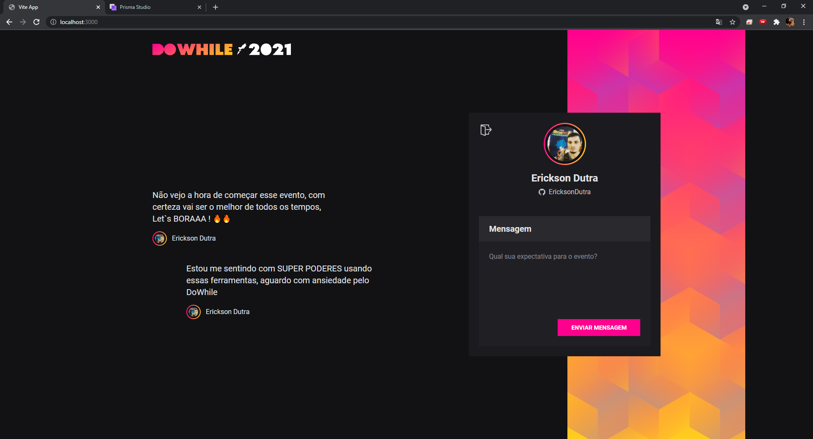
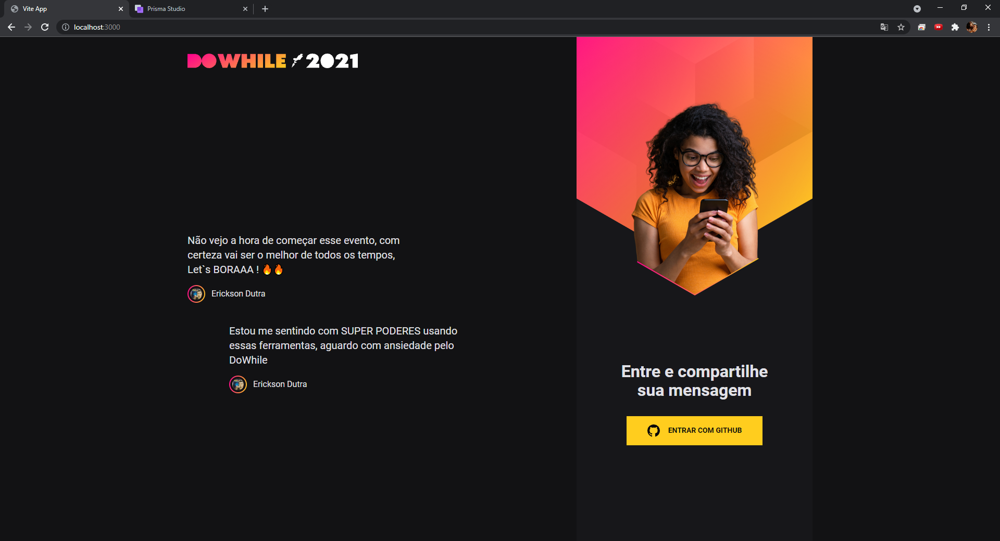

<h1 >
NLW Heat - App Front-End - React
</h1>

Aplicação criada usando uma Vite (Build Tool) 

[Integrada ao Back-end construído em NodeJs, disponível no repositório: https://github.com/EricksonDutra/NLW-HEAT](https://github.com/EricksonDutra/NLW-HEAT) 

 

  

  

